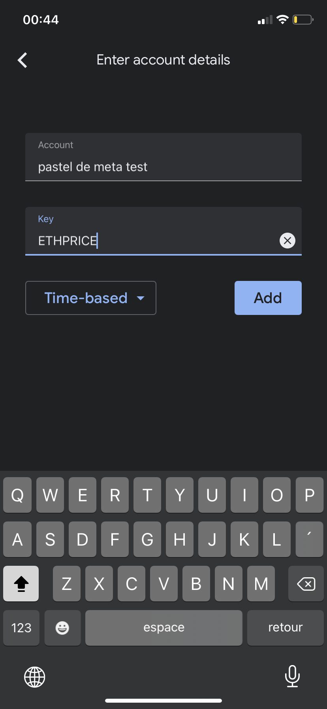
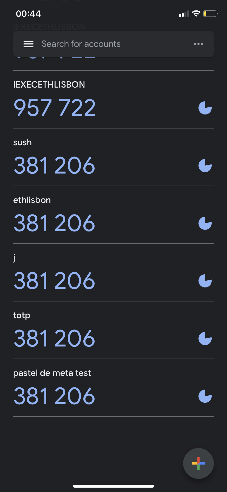

## Pastel de Meta 
is a decentralized 2FA system to get a higher level of security when interacting with the Ethereum space through Metamask.

### How it works
2fa verification is done by an application that runs on the iExec decentralized infrastructure. 
The application is called by Metamask when the user wants to execute a transaction.

Specifications are available [here](https://github.com/cedelabs/2fa-snap/blob/main/specifications.md).

## This project contains several modules:
- iexec-projects - 2fa verifier running on a decentralized computation platform iExec
- safe-2fa-snap - MM snap with a dApp to setup and use the 2fa on any dApp
- metamask extension - we customized MM extension in order to put the input field on the confirmation page
- 2fa-service - AWS service for a demo (iExec is down) 

To launch Metamask Extension:
- ```nvm use v16.10.0```
- ```yarn```
- ```yarn setup``` 
- ```yarn start --build-type=flask``` 

To launch safe-2fa-snap UI:
- ```yarn```
- ```yarn start``` 
Then navigate to http://localhost:8000/onBoarding to setup the 2fa code
- First, add guardians (they can help you to recover your account if you lost your 2fa code)
- Then, generate a 2fa code
- Scan the QR code with you 2fa App (Google Authenticator, Authy, etc.)
- Enter the 2fa code in the input field

## Things to do to finish the project
- Resolve snaps issue:
  - Due to the usage of `yup` dependency by iExec SDK, snap build fails. It's due to the SES building environement. (https://docs.metamask.io/guide/snaps-development-guide.html#developing-a-snap)
- Implement Guardian recovery

## test iexec app, interfaces
the last version of the app is deployed on "bellecour" chain with the address below:

app address: ```0x0B9d561E978d8D788135575662e690DA5B6ECEa3```

it has 3 methods:
- setup (get my totp secret) WORKING
- signature <6-digit code> (verify code, "VALID" or "INVALID") WORKING
- signaturev2 <6-digit code> (verify code and sign transaction using safe) DEVELOPMENT

### at first, initialize iexec:

```npm i -g iexec```

```iexec init --skip-wallet```

```iexec storage init --chain bellecour```

### calling the application

1. Let's call the setup method to get the TOTP secret to add in the generator app

```iexec app run 0x0B9d561E978d8D788135575662e690DA5B6ECEa3 --args "setup" --watch --chain bellecour```

2. Get the result of the execution (the task_id will be printed to console during the execution as "Task idx 0"):

```iexec task show <task_id> --download my-app-result --chain bellecour && unzip my-app-result.zip -d my-app-result```

normally you've got 'ETHPRICE' very secret code. 

3. Using the code from the output, create a totp code generator in an application like google authenticator




4. Let's try to use the code. Enter the code from the application inside <6_digit_code> and call the application:

```iexec app run 0x0B9d561E978d8D788135575662e690DA5B6ECEa3 --args "signature <6_digit_code>" --watch --chain bellecour```

5. Get the result of the execution in the output exactly like in step 2. If the code is valid, you get "VALID" otherwise, "INVALID"